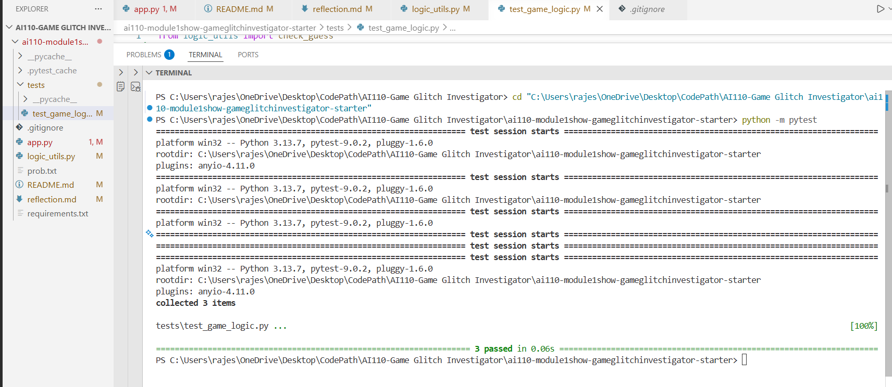

# 🎮 Game Glitch Investigator: The Impossible Guesser

## 🚨 The Situation

You asked an AI to build a simple "Number Guessing Game" using Streamlit.
It wrote the code, ran away, and now the game is unplayable. 

- You can't win.
- The hints lie to you.
- The secret number seems to have commitment issues.

## 🛠️ Setup

1. Install dependencies: `pip install -r requirements.txt`
2. Run the broken app: `python -m streamlit run app.py`

## 🕵️‍♂️ Your Mission

1. **Play the game.** Open the "Developer Debug Info" tab in the app to see the secret number. Try to win.
2. **Find the State Bug.** Why does the secret number change every time you click "Submit"? Ask ChatGPT: *"How do I keep a variable from resetting in Streamlit when I click a button?"*
3. **Fix the Logic.** The hints ("Higher/Lower") are wrong. Fix them.
4. **Refactor & Test.** - Move the logic into `logic_utils.py`.
   - Run `pytest` in your terminal.
   - Keep fixing until all tests pass!

## 📝 Document Your Experience

- [x] Describe the game's purpose.
This project is a debugging exercise where an AI-generated number guessing game built with Streamlit had several logic and state management bugs. The goal was to investigate the issues, fix the bugs, and refactor the code into a cleaner structure.

- [x] Detail which bugs you found.
While testing the game, I discovered several problems:
- The hint logic was reversed, causing the game to tell the player to guess lower when the guess was already lower than the secret number.
- The secret number did not reset correctly when the difficulty changed.
- The attempts counter started incorrectly, causing the first guess to be miscounted.
- The game state did not reset properly when starting a new game.

- [x] Explain what fixes you applied.
To fix these problems, I moved the core game logic into `logic_utils.py` and corrected the hint logic in the `check_guess` function. I also fixed the session state handling so that the secret number resets correctly when the difficulty changes and when a new game starts. I verified the fixes by manually testing the game in Streamlit and by running automated tests using `pytest`.

## 📸 Demo

Below is the pytest output showing that all 3 tests passed.
- [ ] 

## 🚀 Stretch Features

- [ ] [If you choose to complete Challenge 4, insert a screenshot of your Enhanced Game UI here]
